# Reference Architecture — Iranian Enterprise AI Bridge (IEAB)

## 1. High-Level Architecture Overview
The core tenet of IEAB is **strict separation of deterministic calculations from natural language generation**. Large Language Models (LLMs) are probabilistic and must never act as ledgers, financial calculators, or unrestricted SQL generators against production ERP databases.

```mermaid
flowchart TD
    subgraph OperationalSystems["1. Operational Source Systems"]
        ERP["Rahkaran / ShAuto / Rayvarz / Sepidar"]
        CRM["PayamGostar / Didar / Dana"]
        BPMS["Didgah Chargoon / Automation"]
        Legacy["Generic MSSQL / CSV & Excel"]
    end

    subgraph Ingestion["2. Extraction & Synchronization"]
        Replica["Read Replica (AlwaysOn)"]
        CDC["CDC / Change Tracking"]
        API["REST / SOAP Services"]
        SDK["@ieab/connector-sdk"]
    end

    subgraph Canonical["3. Canonical Model & Storage"]
        CDM["@ieab/canonical-model"]
        Warehouse["PostgreSQL / ClickHouse"]
    end

    subgraph Semantic["4. Semantic Layer & Governance"]
        Contracts["CFO / COO Approved Metric Contracts"]
        MetricsEngine["@ieab/metrics (Deterministic Calculations)"]
        Reconciliation["Subledger to GL Reconciliation Engine"]
    end

    subgraph AIPlatform["5. AI Tools, Security & Orchestration"]
        Policy["@ieab/policy-engine (RBAC & PII Masking)"]
        AIGateway["@ieab/ai-gateway (vLLM On-Prem / Cloud)"]
        AgentRuntime["@ieab/agent-runtime (Orchestrator)"]
        AuditLedger["@ieab/audit (Immutable Ledger)"]
    end

    subgraph ExecutiveUI["6. Executive Copilot Experience"]
        Now["Now"]
        Exceptions["Exceptions"]
        Why["Why (Root Cause)"]
        Next["Next (Cash Forecast)"]
        Ask["Ask (Evidence-First Chat)"]
    end

    OperationalSystems --> Ingestion
    Ingestion --> Canonical
    Canonical --> Semantic
    Semantic --> AIPlatform
    AIPlatform --> ExecutiveUI
```

---

## 2. Six Core Architectural Layers

1. **Operational Source Systems:** Microsoft SQL Server (>80% Iranian on-prem ERP market share), SOAP/WCF services, REST APIs, and Excel exports.
2. **Ingestion & Synchronization:** Read-only connections (`ApplicationIntent=ReadOnly`), AlwaysOn Read Replicas to avoid locking production OLTP tables, and Change Tracking.
3. **Canonical Data Model:** Normalization into 11 vendor-independent domain schemas preserving source primary keys (`sourcePk`) and SHA-256 checksums for complete backward traceability.
4. **Semantic Layer & Deterministic Calculations:** CFO-governed formulas for Gross/Net Sales, DSO, Cash Position, and COO-governed OEE, Scrap Rates, and Machine Downtime.
5. **AI Gateway, Security & Audit:** Multi-provider gateway supporting local vLLM/Ollama (Qwen 2.5 72B / DeepSeek-R1) and Cloud APIs, automated PII masking, and an immutable audit ledger.
6. **Executive Copilot UI:** 5-dimensional CEO interface (Now, Exceptions, Why, Next, Ask) with explicit reconciliation verification (`RECONCILED` badge) and drill-down references.
