# معماری مرجع پل هوش مصنوعی سازمانی ایران (IEAB Reference Architecture)

## ۱. بیانیه معماری کلان
پل هوش مصنوعی سازمانی ایران بر مبنای اصل **جداسازی محاسبات قطعی از تولید زبان طبیعی** بنا شده است. مدل‌های زبانی (LLMs) ذاتاً احتمالاتی هستند و نباید به عنوان مرجع ثبت، دفترکل یا ماشین‌حساب سازمان استفاده شوند.

```mermaid
flowchart TD
    subgraph OperationalSystems["۱. سامانه‌های عملیاتی سازمان"]
        ERP["راهکاران / شماران / رایورز / سپیدار"]
        CRM["پیام‌گستر / دیدار / دانا"]
        BPMS["دیدگاه چارگون / اتوماسیون"]
        Legacy["پایگاه داده SQL Server / فایل‌های اکسل"]
    end

    subgraph Ingestion["۲. لایه استخراج و همگام‌سازی"]
        Replica["Read Replica (AlwaysOn)"]
        CDC["CDC / Change Tracking"]
        API["REST / SOAP Services"]
        SDK["@ieab/connector-sdk"]
    end

    subgraph Canonical["۳. خط لوله یکسان‌سازی و انبار داده"]
        CDM["@ieab/canonical-model"]
        Warehouse["PostgreSQL / ClickHouse"]
    end

    subgraph Semantic["۴. لایه معنایی و حاکمیت شاخص‌ها"]
        Contracts["قراردادهای شاخص مصوب CFO/COO"]
        MetricsEngine["@ieab/metrics (محاسبات قطعی)"]
        Reconciliation["موتور تطبیق دفاتر با زیرسیستم‌ها"]
    end

    subgraph AIPlatform["۵. درگاه ابزارها و عاملیت هوشمند"]
        Policy["@ieab/policy-engine (RBAC & PII Masking)"]
        AIGateway["@ieab/ai-gateway (vLLM On-Prem / Cloud)"]
        AgentRuntime["@ieab/agent-runtime (Orchestrator)"]
        AuditLedger["@ieab/audit (دفترکل تغییرناپذیر)"]
    end

    subgraph ExecutiveUI["۶. میز کار اجرایی مدیرعامل"]
        Now["اکنون (Now)"]
        Exceptions["استثنائات (Exceptions)"]
        Why["تحلیل ریشه‌ای (Why)"]
        Next["پیش‌بینی نقدینگی (Next)"]
        Ask["پرسش فارسی همراه با شواهد (Ask)"]
    end

    OperationalSystems --> Ingestion
    Ingestion --> Canonical
    Canonical --> Semantic
    Semantic --> AIPlatform
    AIPlatform --> ExecutiveUI
```

---

## ۲. لایه‌های شش‌گانه معماری

### لایه اول: سامانه‌های عملیاتی مبدأ (Operational Sources)
پایگاه داده‌های رابطه‌ای (به‌ویژه Microsoft SQL Server که بیش از ۸۰٪ سهم بازار ERPهای مستقر در ایران را در اختیار دارد)، وب‌سرویس‌های SOAP/WCF، درگاه‌های REST API و پرونده‌های گسترده اکسل.

### لایه دوم: یکپارچه‌سازی و استخراج تغییرات (Ingestion & CDC)
- اجبار به برقراری ارتباط با صفت `ApplicationIntent=ReadOnly`
- بهره‌گیری از AlwaysOn Read Replicas جهت عدم ایجاد Lock بر جداول عملیاتی صدور فاکتور و کاردکس
- پایش تغییرات بر اساس Change Tracking و ستون‌های ModifiedDate

### لایه سوم: مدل داده کاننیکال (Canonical Data Model)
تبدیل ساختار جداول مختلف به ۱۱ موجودیت استاندارد شده مستقل از تأمین‌کننده همراه با حفظ انحصاری شناسه رکورد مبدأ (`sourcePk`) و چک‌سام SHA-256 جهت ممیزی معکوس.

### لایه چهارم: لایه معنایی و محاسبات قطعی (Semantic Layer)
تعریف صریح فرمول‌های مالی توسط مدیر مالی (CFO) و فرمول‌های صنعتی توسط مدیر عملیات (COO). محاسبات تماماً توسط کدهای جاوااسکریپت/تایپ‌اسکریپت ایزوله و قطعی صورت می‌پذیرد.

### لایه پنجم: امنیت، ممیزی و ارکستراسیون هوش مصنوعی
- درگاه هوش مصنوعی چندگانه متصل به سرورهای محلی vLLM (مدل‌های Qwen 2.5 72B و DeepSeek-R1)
- ماسک داده‌های هویتی و پرسنلی
- ثبت تغییرناپذیر تمامی درخواست‌ها، مدل استفاده‌شده و شواهد در `@ieab/audit`

### لایه ششم: تجربه کاربری اجرایی مدیرعامل
ارائه بینش‌ها در پنج سطح Now, Exceptions, Why, Next و Ask با برچسب تطبیق مالی `RECONCILED` و امکان بازبینی ریز اسناد منبع.
